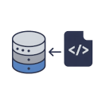

# VSCode Open Migration extension

This extension helps you to quickly work with your migration files.

## Features

- Open latest migration file
- Open specific migration
- Reveal migration folder in file explorer
- Customize own paths to search for migration files in your project

Default supported migration folders are:

- Ruby on Rails: `db/migrate/*.rb`
- Elixir Ecto: `priv/repo/migrations/*.exs`
- Laravel: `database/migrations/*.php`
- Django: `migrations/*.py`

You can customize them - see [Customize migration folders](#customize-migration-folders) section.

## Usage

### Open latest migration file

Press `Ctrl+Shift+P` and type `Open latest migration` to open the latest migration file.


### Open specific migration

Press `Ctrl+Shift+P` and type `Open migration file...` to open a specific migration file. Files are sorted from newest to oldest.


### Reveal migration folder in file explorer

Press `Ctrl+Shift+P` and type `Reveal migration folder` to reveal the migration folder in file explorer. First folder found in the list of set migration folders will be used.


## Customize migration folders

### Add migration folder

In case you have your migration files in a custom folder, or multiple folders, you can set them in the settings. This will be applied to the workspace.

Press `Ctrl+Shift+P` and type `Add migration folder for this workspace` to add a custom migration folder. You have to specify wildcard path to the folder. For example, `**/database/migrations/*` will search for all migration files in all `migrations` folders in your project.

Default migration folders for every workspace are:

```json
["db/migrate/*.rb", "priv/repo/migrations/*.exs", "database/migrations/*.php", "migrations/*.py"]
```

So for example, if you have Ruby on Rails project with multiple databases, you can add `db/second_db/*.rb` to the settings and all folders will be searched for migration files.

### Remove migration folder

Press `Ctrl+Shift+P` and type `Remove migration folder for this workspace` to remove a custom migration folder from the list.

### Reset migration folders

Press `Ctrl+Shift+P` and type `Reset migration folders to defaults` to reset the list of custom migration folders.

## Release Notes

Check the [CHANGELOG.md](CHANGELOG.md) for details.

**Enjoy!**
